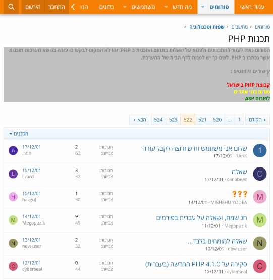

# Tapuz Forum Scraper

This is a basic scraper for [Tapuz forums](https://www.tapuz.co.il/forums/).



These forums were very popular during the early 2000s, after [taking in](https://www.ynet.co.il/articles/0,7340,L-2985307,00.html) most of the IOL community. 

It's still possible to publicly access the forum posts, but the search feature is broken. 


Using this crawler, it's possible to search for all posts in a given forum, or all posts by a given user in a given forum.

```console
# Scrape all posts from https://www.tapuz.co.il/forums/%D7%AA%D7%9B%D7%A0%D7%95%D7%AA-php.617/
$ scrapy crawl tapuzscraper -a forum_id=617 -O out.json

# Scrape all posts for a given username from the same forum
$ scrapy crawl tapuzscraper -a forum_id=617 -a user_name="my_user_name" -O out.json
```

The posts are outputted as a JSON file. It's possible to format them in a user-friendly format using the provided `posts2html.py` script.

```console
$ python3 ./posts2html.py -i ./out.json -o ./out.html
Processed 73 post(s).
```

## Prerequisites 

The script requires `python3` and `scrapy`:

```console
python3 -m pip install scrapy
```